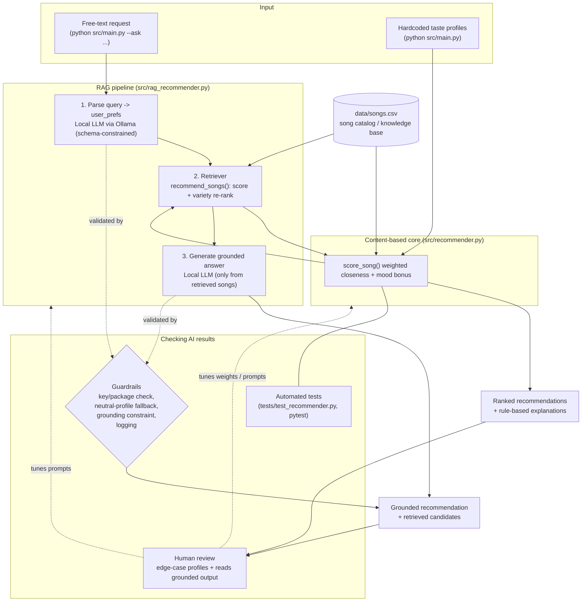

# System Diagram — Music Recommender (RAG + Content-Based Scorer)

This diagram shows the two entry paths (RAG mode and the profile demo), how a
request flows from input to output, and where testing / human review check the
AI's results.

## Legend

- **Input** — two entry points: a free-text request (RAG mode) or the built-in
  taste profiles (profile demo).
- **Retriever** — the existing `recommend_songs` scorer over `songs.csv`; it is
  reused as the RAG retriever so the AI feature is integrated, not bolted on.
- **Agent (LLM stages)** — a local LLM (via Ollama) parses the query (stage 1)
  and generates the final recommendation grounded only in retrieved songs
  (stage 3).
- **Evaluator / Tester** — `pytest` checks the deterministic scorer; guardrails
  validate the LLM stages at runtime (fallbacks, grounding, logging).
- **Human-in-the-loop** — a person runs adversarial edge-case profiles and reads
  the grounded output, then tunes feature weights and prompts.
